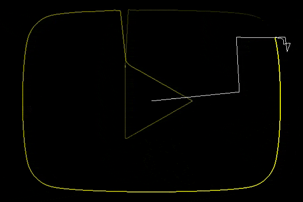
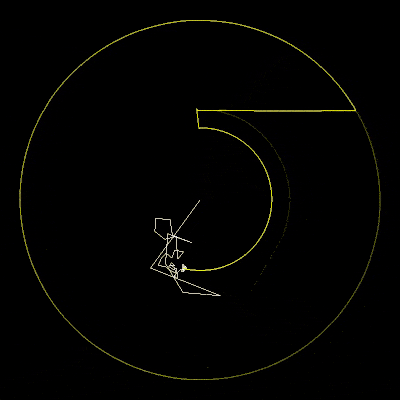

# fourier-drawer
<div align="center">

</div>

## Requires
- Python3
- ffmpeg [download](https://ffmpeg.org/download.html)

## Installation
1. Install the above requirements
2. Clone/download this repository
3. Run `pip install -r requirements.txt`

### Installation for Cuda
Requires a Cuda compatible GPU
1. Follow instructions [here](https://docs.cupy.dev/en/stable/install.html) to install the proper version of cupy
2. Run `pip install -r requirements_cuda.txt`

## Usage
```
python legacy.py [-h] -i INPUT [-o OUTPUT] (-s | -b | -v | -p) [-t TIMESCALE] [-d DURATION]
			   [-tl TRAIL_LENGTH] [-tf | -ntf] [-tc TRAIL_COLOR] [-vc VECTOR_COLOR] [-fps FPS]
			   [-fpf FRAMES_PER_FRAME] [-dim DIMENSION] [--border BORDER]
			   [--density DENSITY | --points POINTS] [--info] [--save-path SAVE_PATH]

  -h, --help				show this help message and exit

Input Options
  -i INPUT, --input INPUT		the input file
  -o OUTPUT, --output OUTPUT		the output file name
  
  -s, --svg             		marks the input file as a svg
  -b, --bitmap          		marks the input file as a bitmap type (bmp, png, jpg, etc.)
  -v, --video           		marks the input file as a video type (mp4, avi, mov, etc.)
  -p, --path            		marks the input file as a .npy (numpy array) file)

Rendering Options
  -ss {math}, --start {math}		the time after which writing to file begins
  -t {math}, --timescale {math} 	how many seconds video time is 1 second real time
  -d {math}, --duration {math} 		the duration of video time to render
  -tl {math}, --trail-length {math} 	the duration of video time to keep the trail visible
  -tf, --trail-fade     		whether the tail should fade with time (default)
  -ntf, --no-trail-fade 		whether the tail should fade with time
  -tc #xxxxxx, --trail-color #xxxxxx 	color of the trail as a hexcode
  -vc #xxxxxx, --vector-color #xxxxxx 	color of the vectors as a hexcode
  -fps FPS              		fps of the output video
  -fpf {math}, --frames-per-frame {math}
					A frame is saved every this many frames.
					There are 2*pi*60/{timescale} frames in a render. (Casted to int)
								
  -dim [w]x[h], --dimension [w]x[h] 	dimensions of the output video (defaults to image/video dimensions,
					or 800x800 for svg, infered using border for path)

  --border BORDER       		percentage (as a float) of border between the path and screen
  
  -g GPU, --gpu GPU			Use Cuda to accelerate rendering process (use a number to specify a gpu or * for any)
  
  -m-lim MEMORY_LIMIT, --memory-limit MEMORY_LIMIT
                        		(Approximate) Sets the maximum amount of memory the program should use during rendering.
					If it is insufficient the program will request for more.
					Accepts a number followed by a unit (K,M,G)
  
Path Options
  --density DENSITY     		how densely packed are samples of a path
  --points POINTS       		how many point in an image or frame

Miscellaneous Options
  --info                		Prints some info about the sketch
  --show                		Display the sketch during rendering
  --save-path SAVE_PATH 		saves the path in a file to save recomputation
					(dimensions aren't saved but infered on load)

Note:
  - There are 2pi video time seconds in 1 cycle
  - {math} accepts mathematical expressions (ex. '2*pi+1', '1/${frames}') 
    Valid symbols: any number using [0-9.], +-*/, pi, ${frames}
```

## Examples

<div align="center">

</div>

```
python legacy.py -i sample\yt.svg -s -o sample\yt -ss 2*pi --density 5 -dim 600x400
```

<div align="center">


</div>

```
python legacy.py -i sample\chrome.svg -s -o sample\chrome -t 1/8 -fpf 4 --density 25 -ss 2*pi -tl 1.5*pi
python legacy.py -i sample\grass.png -b -o sample\grass -t 1/8 -fpf 4 -d 3*pi -dim 400x400 -tl 2.5*pi -tc #00ff00 -vc #888888
```

<div align="center">

</div>

```
python legacy.py -i sample\zvs.png -b -o sample\zvs -t 1/64 -fpf 24 -d 2*pi -ntf
```
